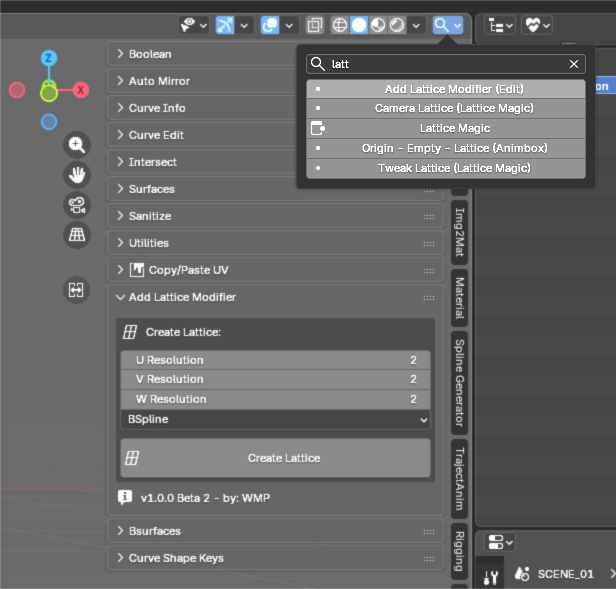

# Sidebar Tab Search (Blender Add-on)

Ten dodatek do Blendera 5.0 (i nowszych) dodaje szybką wyszukiwarkę kart paska bocznego (N-Panel), umieszczoną wygodnie w nagłówku widoku 3D.

## Funkcje

- **Ikonka w Nagłówku**: Mała ikonka lupy w nagłówku widoku 3D (obok opcji wyświetlania).
- **Wyszukiwanie**: Szybkie znajdowanie zakładek po nazwie.
- **Podkategorie**: Wyszukuje również nazwy paneli wewnątrz zakładek (np. "Auto Mirror" w zakładce "Edit").
- **Inteligentne Przełączanie**:
  - Automatycznie otwiera pasek boczny, jeśli jest ukryty.
  - Przewija widok do początku znalezionej karty/panelu.
- **Polska Wersja Językowa**: Interfejs w pełni po polsku.

## Instalacja

1. Pobierz plik `search_sidebar_tabs.zip`.
2. Otwórz Blender.
3. Przejdź do **Edit -> Preferences -> Add-ons**.
4. Kliknij przycisk **Install...** (w prawym górnym rogu).
5. Wybierz pobrany plik `.zip`.
6. Zaznacz pole przy nowym dodatku na liście, aby go aktywować (kategoria **Interface**).

## Użycie

1. W widoku 3D spójrz na nagłówek (górna belka).
2. Kliknij ikonkę lupy.
3. Wpisz nazwę szukanej funkcji lub zakładki.
4. Kliknij na wynik z listy, aby natychmiast się tam przenieść.

---

# English Version

This add-on for Blender 5.0 (and newer) adds a quick search for Sidebar (N-Panel) tabs, conveniently located in the 3D Viewport header.

## Features

- **Header Icon**: A small magnifying glass icon in the 3D Viewport header (next to display options).
- **Search**: Quickly find tabs by name.
- **Sub-categories**: Also searches for panel names inside tabs (e.g., "Auto Mirror" inside the "Edit" tab).
- **Smart Switching**:
  - Automatically opens the Sidebar if it is hidden.
  - Scrolls the view to the top of the found tab/panel.
- **Polish Language**: The interface is currently in Polish.

## Installation

1. Download the `search_sidebar_tabs.zip` file.
2. Open Blender.
3. Go to **Edit -> Preferences -> Add-ons**.
4. Click the **Install...** button (top right corner).
5. Select the downloaded `.zip` file.
6. Check the box next to the new add-on in the list to activate it (category **Interface**).

## Usage

1. In the 3D Viewport, look at the header (top bar).
2. Click the magnifying glass icon.
3. Type the name of the function or tab you are looking for.
4. Click on a result in the list to instantly navigate there.
